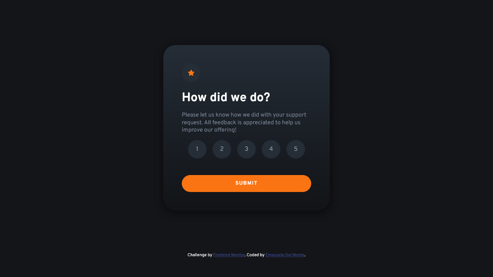

# Frontend Mentor - Interactive rating component solution

This is a solution to the [Interactive rating component challenge on Frontend Mentor](https://www.frontendmentor.io/challenges/interactive-rating-component-koxpeBUmI). Frontend Mentor challenges help you improve your coding skills by building realistic projects.

## Table of contents

- [The challenge](#the-challenge)
- [Screenshot](#screenshot)
- [Links](#links)
- [Built with](#built-with)
- [What I learned](#what-i-learned)
- [Continued development](#continued-development)
- [Useful resources](#useful-resources)
- [Author](#author)

### The challenge

Users should be able to:

- View the optimal layout for the app depending on their device's screen size
- See hover states for all interactive elements on the page
- Select and submit a number rating
- See the "Thank you" card state after submitting a rating

### Screenshot



### Links

- Live Site URL: [htmlpreview](https://htmlpreview.github.io/?https://github.com/xdelmo/interactive-rating-component/blob/master/index.html)

### Built with

- Semantic HTML5 markup
- CSS custom properties
- Flexbox
- Vanilla Javascript
- Mobile-first workflow

### What I learned

My main trouble was very flawed input on circles' numbers. Finally I solved the problem increasing padding on the labels.

```css
label {
  cursor: pointer;
  /* to get the click input on the whole circle, not only in the center */
  padding: 1em;
}
```

On the JS's side everything is new for me, so I learn how to use a radio input as a value and

```js
const btn = document.querySelector("#btn"); // button
const radioButtons = document.querySelectorAll('input[name="input-rating"]'); // variable for radio buttons
let span = document.getElementById("choice"); // variable to replace span in thank-you card

// listens to click on btn and add the radioButton value checked to selectedRating
btn.addEventListener("click", () => {
  let selectedRating;
  for (const radioButton of radioButtons) {
    if (radioButton.checked) {
      selectedRating = radioButton.value;
      break;
    }
  }

  // shows thank-you card changing its display:style in block
  document.getElementById("thank-you").style.display = "block";

  // hides evaluation card changing its display:style in none
  document.getElementById("evaluation").style.display = "none";

  // replaces span tag with the selectedRating variable
  span.innerHTML = selectedRating;
});
```

### Continued development

I'd like to mantain orange background on the radio button checked, not only on click and a way to smooth hide/show card animations.

### Useful resources

- [Alekususenpai's solution](https://github.com/Alekususenpai/interactive-rating-component) - Her solution helped me to understand how to hide/show divs.
- [JavaScript Radio Button](https://www.javascripttutorial.net/javascript-dom/javascript-radio-button/#:~:text=Introduction%20to%20the%20JavaScript%20Radio,is%20called%20a%20radio%20group.) - This is an amazing article which helped me to write Javascript script because I'm still a newbie.

## Author

- Website - [Emanuele Del Monte](https://www.emanueledelmonte.com)
- Frontend Mentor - [@yourusername](https://www.frontendmentor.io/profile/xdelmo)
